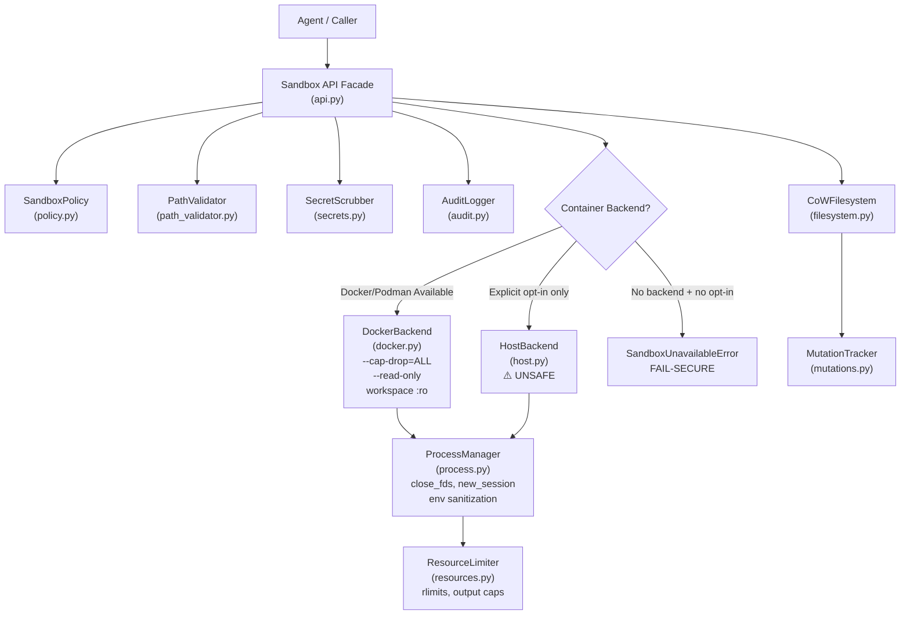

# Pulse Sandbox — Security Architecture & Threat Model

## Architecture Overview



## Threat Model

### Adversary Profile
- **Capability**: Full control over code generation (arbitrary Python, shell commands, file content).
- **Goal**: Escape sandbox, read sensitive host files, exfiltrate data, persist backdoors, exhaust host resources.
- **Access**: Can request any sandbox API operation (read, write, execute, delete).

### Attack Vectors & Mitigations

| # | Attack Vector | Severity | Mitigation | Module |
|---|---------------|----------|------------|--------|
| 1 | **CoW Bypass** — shell writes directly to workspace inside container | Critical | Workspace mounted `:ro` in Docker. Writable overlay at `/workspace-overlay`. | `docker.py` |
| 2 | **Silent Host Fallback** — no Docker → code runs on host | Critical | `SandboxUnavailableError` raised. Host requires `unsafe_host_execution=True`. | `api.py`, `errors.py` |
| 3 | **TOCTOU Race** — symlink swap between validate and open | High | `safe_open()` with `O_NOFOLLOW`, post-open `fstat()` re-validation. | `path_validator.py` |
| 4 | **ReDoS** — pathological input hangs secret scrubber | High | Bounded quantifiers, no nested quantifiers, thread-based timeout guard. | `secrets.py` |
| 5 | **Case Bypass** — `SECRETS/Config.JSON` evades `secrets/*` deny rule | High | `normalize_target()` with NFC Unicode + lowercase + separator normalization. Dual-match. | `policy.py` |
| 6 | **Memory Exhaustion** — read 10GB file or infinite stdout | High | `MAX_FILE_SIZE` enforced via `fstat()` before read. Incremental output collection with kill. | `path_validator.py`, `process.py` |
| 7 | **Log Injection** — newline in target corrupts JSONL | Medium | Control character sanitization in audit logger. | `audit.py` |
| 8 | **Env Leakage** — `LD_PRELOAD` inherited by child | Medium | `DANGEROUS_ENV_VARS` stripped from subprocess environment. | `resources.py` |
| 9 | **FD Leakage** — parent FDs inherited by child | Medium | `close_fds=True`, `start_new_session=True` on subprocesses. | `process.py` |
| 10 | **Fork Bomb** — child spawns unlimited processes | Medium | `RLIMIT_NPROC`, `--pids-limit` in Docker. | `resources.py`, `docker.py` |
| 11 | **Swap Exhaustion** — process uses swap after memory limit | Medium | `--memory-swap` set equal to `--memory` in Docker. | `docker.py` |
| 12 | **Container Root** — process runs as root inside container | Medium | `--user 65534:65534` (nobody). | `docker.py` |
| 13 | **Staging Exhaustion** — unlimited CoW staging files | Medium | `MAX_STAGING_SIZE_BYTES`, `MAX_STAGED_FILE_SIZE_BYTES`, `MAX_CONCURRENT_TRANSACTIONS`. | `filesystem.py` |

## Security Assumptions

1. **The host OS kernel is trusted.** Container isolation relies on kernel namespaces and cgroups.
2. **Docker/Podman daemon is trusted.** We assume the container runtime is not compromised.
3. **The `pulse` process itself is trusted.** The sandbox protects against malicious _generated code_, not against a compromised host process.
4. **File system permissions are correctly configured.** The workspace directory should be owned by the user running Pulse.

## API Reference

### `Sandbox(workspace_root, *, unsafe_host_execution=False, ...)`

Main entry point. Must call `await sandbox.initialize()` before `execute_command()`.

- `unsafe_host_execution=False` (default): raises `SandboxUnavailableError` if no Docker.
- `unsafe_host_execution=True`: falls back to host with warnings + audit logging.

### `sandbox.read_file(relative_path) -> str`

TOCTOU-safe read with policy check, size limit, and secret scrubbing.

### `await sandbox.execute_command(command, cwd=None, env=None) -> ProcessResult`

Executes in container (workspace `:ro`) or host (if opted in). Policy-checked. Output scrubbed.

### `sandbox.create_transaction() -> CoWTransaction`

Creates an isolated staging area for writes. Stage → preview → commit/discard.

## Deployment Guide

### Requirements

- **Production**: Docker or Podman must be installed and accessible.
- **Development**: Can use `unsafe_host_execution=True` for local testing without Docker.

### Configuration

```python
from pulse.sandbox import Sandbox, SandboxPolicy, PolicyRule, PolicyDecision

policy = SandboxPolicy()
policy.add_rule(PolicyRule(action="shell", target_pattern="pytest*", decision=PolicyDecision.ALLOW))
policy.add_rule(PolicyRule(action="write", target_pattern="src/*", decision=PolicyDecision.ALLOW))

sandbox = Sandbox(
    workspace_root=Path("/my/project"),
    policy=policy,
    secrets=["sk-my-api-key"],
    unsafe_host_execution=False,  # Fail-secure (default)
)
await sandbox.initialize()
```

## Known Limitations

1. **HostBackend provides NO isolation.** It is defense-in-depth only (env sanitization, rlimits, path validation). An attacker with shell access on HostBackend can escape.
2. **Windows resource limits** are limited — `RLIMIT_NPROC`, `RLIMIT_AS`, `RLIMIT_NOFILE` are not available. Docker is strongly recommended on Windows.
3. **`O_NOFOLLOW`** is not available on Windows. TOCTOU protection on Windows relies on `lstat`/`fstat` cross-validation of inode identity (`st_ino`, `st_dev`). This strongly mitigates but does not strictly eliminate the race window at the OS API level.
4. **Network isolation** is only enforced in Docker (`--network none`). HostBackend cannot enforce network restrictions.
